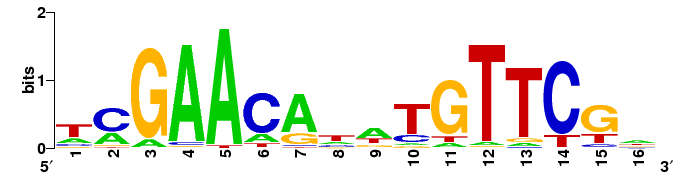

# D3-sequence-logo
A DNA nucleotide visualization (sequence-logo) tool using D3 SVG library.

Sometimes in molecular biology research, nucleotide sequences from a small section of DNA (commonly referred to as genes) 
are acquired from several cells, either from different types of cells within the same animal, or from the same type of cell 
from different animals.  These nucleotide sequences are then studied for any possible patterns. 

This program is a web-based platform for visualizing one possible set of patterns based on the nucleotide count among the various
acquired sequences. This visualization technique is known as a sequence-logo. In this technique, the higher the count of a particular
nucleotide at a particular position (position is important) among all the acquired sequences, the larger the letter representing that
nucleotide will appear in the logo, at the corresponding position. For example, starting at position 1 from left to 4 on right, if the 
following four sequences were being studied: ACTG AGGT CGGC ACCG, then at position 1, the letter A would be three times the height of 
letter C (both would be shown) since the letter A appears three times as often as the letter C at that position in the sequences.

This sequence logo generator uses D3.js, an open-source JavaScript library used for visualizing data using SVG and HTML.  Although the 
DNA sequences are hard-coded in this example, an HTML form can easily be made asking for input of DNA sequences.

Example sequence-logo:

